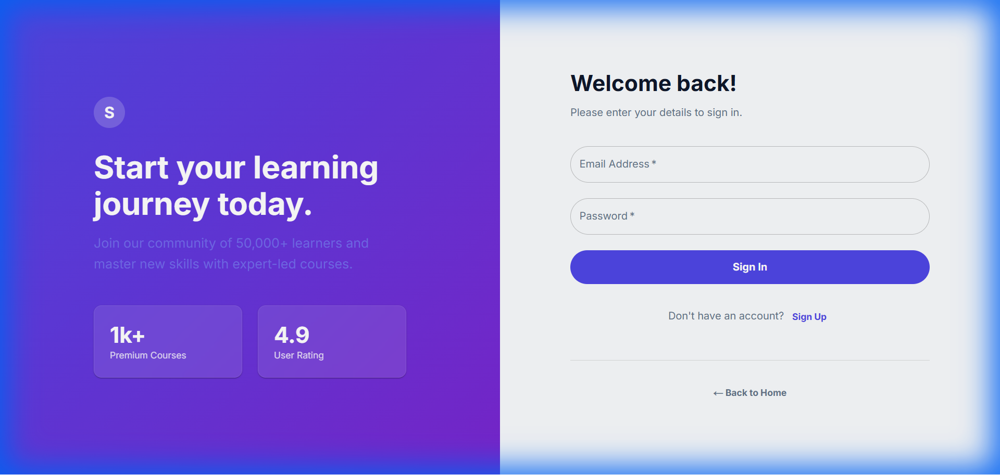
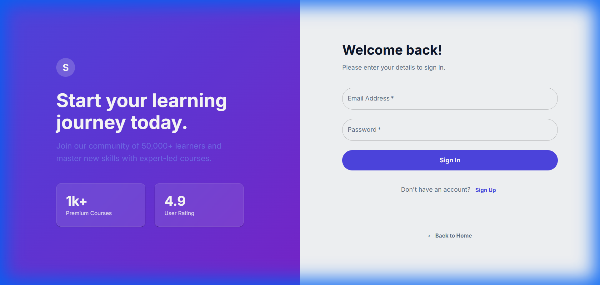

# Walkthrough - Professional Auth Service & MUI Frontend

This walkthrough guides you through running the application with the new **Professional Auth Service** (Node.js + MongoDB) and **MUI Frontend**.

## Prerequisites
- **MongoDB**: Must be running locally on port `27017` OR use Docker Compose.
- **Node.js**: Installed.

## 1. Start the Backend (Auth Service)
The Auth Service runs on port `4001` and connects to MongoDB.

1.  Open a terminal.
2.  Navigate to the auth service directory:
    ```bash
    cd backend/services/auth-service
    ```
3.  Install dependencies (if not done):
    ```bash
    npm install
    ```
4.  Start the service:
    ```bash
    npm run dev
    ```
    *You should see: `MongoDB Connected: ...` and `Auth Service running on port 4001`*

## 2. Start the Frontend
The Frontend runs on port `3000`.

1.  Open a new terminal.
2.  Navigate to the frontend directory:
    ```bash
    cd frontend
    ```
3.  Start the development server:
    ```bash
    npm run dev
    ```

## 3. Verify the Flow

### Step 1: Sign Up
- Open `http://localhost:3000/auth`.
- Switch to "Sign Up".
- Enter details (e.g., "Pro User", "pro@example.com", "password").
- Click "Create Account".
- **Verify**: You should be redirected to `/dashboard`.
- **Note**: User data is now stored in your local MongoDB database.



### Step 2: Dashboard
- Verify the dashboard loads with the user's name.
- Refresh the page to ensure the session persists (via `localStorage`).



### Step 3: Logout
- Click "Logout" to clear the session.

## Docker Support
I have added a `mongo` service to `docker-compose.yml`. To run everything with Docker:
```bash
docker compose up --build
```
This will start the Gateway, Auth Service, User Service, and MongoDB automatically.


